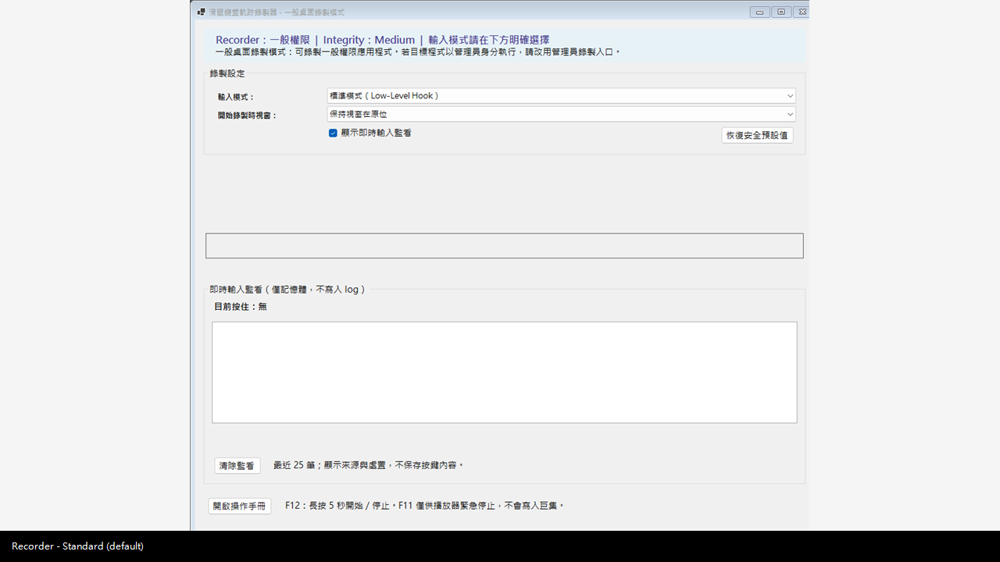
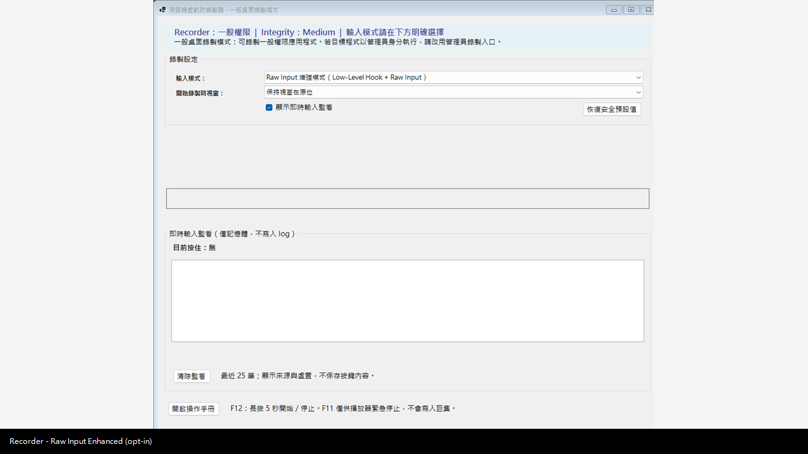
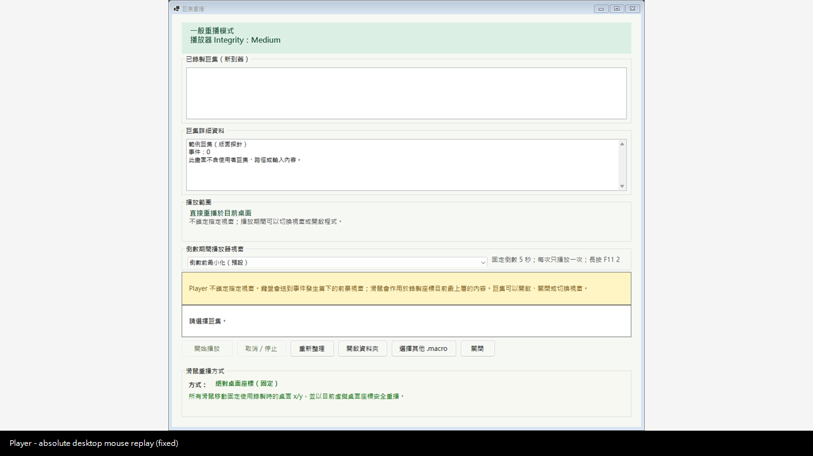
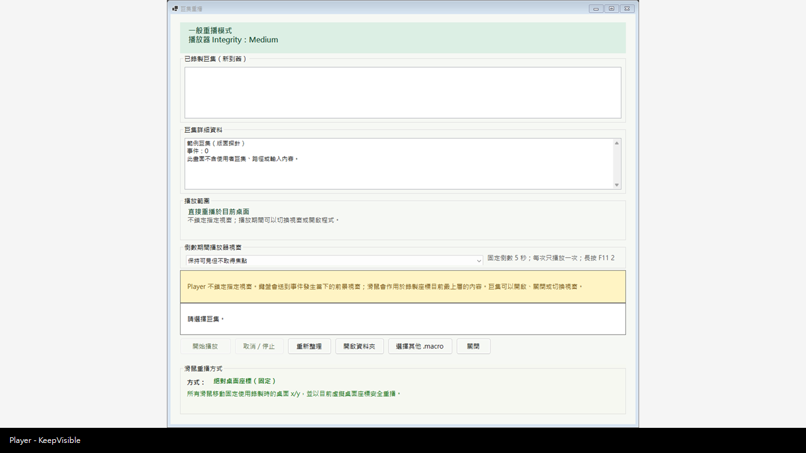

牛逼# MouseKeyboardMacro

MouseKeyboardMacro 是 Windows 11 x64 的本機滑鼠與鍵盤錄製／重播工具。它只處理使用者明確選擇的本機巨集，不提供遠端控制、驅動程式注入或權限繞過。

> English summary: A local-only Windows 11 x64 utility for recording and replaying trusted mouse and keyboard workflows.

## Project purpose

本專案提供可攜式 Recorder、Player、Launcher 與 Safety Watchdog，並以明確的一般／系統管理員入口、單一活動工具限制、倒數與緊急停止機制降低誤操作風險。

## Windows 11 x64

- 支援 Windows 11 x64。
- `framework-dependent` 版本需要 Microsoft .NET 8 Desktop Runtime x64。
- `self-contained` 版本已包含所需 runtime，檔案較大。
- 下載後請先依 `SHA256SUMS.txt` 驗證 ZIP。

## Version 1.0.0

此版本以 production baseline `257fde44cf1554183b538016c322a1a20362228a` 為來源。公開 Repository 不含私人 Git 歷史、使用者巨集、設定、log、PDB 或已編譯 binary。

## Installation

完整解壓縮其中一種 ZIP 到可寫入的資料夾，先閱讀 `START_HERE.txt`，再從根目錄執行五個 CMD 之一。不要只複製 `Program/App` 內的 EXE。詳見 [INSTALL.md](INSTALL.md)。

## Daily launchers

- `06_啟動錄製器_一般模式.cmd`
- `06A_啟動錄製器_管理員模式.cmd`
- `07_選擇並重播巨集_一般模式.cmd`
- `07A_選擇並重播巨集_管理員模式.cmd`
- `99_緊急終止巨集工具.cmd`

## Recording

預設組合是 Standard 錄製模式與 Desktop Safe 安全策略。Recorder 開啟後會保持等待，不會因顯示 UI 就自動開始錄製：在等待狀態長按 F12 5 秒才開始；錄製中再長按 F12 5 秒會停止並把巨集儲存到本機 `Recordings`。F12 是控制手勢，不會寫入巨集。Raw Input Enhanced（Raw Enhanced）是明確選用的進階錄製模式，不是預設；它可在擷取當下使用 raw mouse delta，但新巨集仍會保存可安全重播的桌面絕對座標。

## Playback

Player 只播放使用者選取的巨集，滑鼠重播方式固定為 AbsoluteDesktop（絕對桌面座標），不提供其他滑鼠重播模式。開始前會顯示倒數；播放中長按 F11 2 秒是主要緊急停止，`99_緊急終止巨集工具.cmd` 是外部緊急清理入口。標準權限模式無法可靠控制系統管理員程式；管理員權限巨集由一般 Player 開啟時會 fail closed，必須由使用者明確改用 07A 並接受正常 Windows UAC。本工具不支援也不繞過 UAC secure desktop。

## Input modes

- Standard capture：預設 Low-Level Hook 模式，搭配 Desktop Safe 安全策略。
- Raw Input Enhanced（Raw Enhanced）capture：明確選用後才處理 raw mouse delta，不是預設；新巨集同樣具有有效的桌面絕對座標。
- AbsoluteDesktop playback：唯一滑鼠重播方式，依已記錄的虛擬桌面座標播放。若顯示器排列或解析度改變，播放前請重新確認位置。

詳見 [docs/INPUT_MODES.md](docs/INPUT_MODES.md)。

## KeepVisible

KeepVisible 讓 Player 在倒數與播放期間保持可見；MinimizeBeforeCountdown 則在倒數前最小化。兩者都不會放寬 F11、安全邊界或單一活動工具限制。

## Emergency stop

播放中優先長按 F11 2 秒停止 Player。Recorder 在等待狀態長按 F12 5 秒開始，錄製中再長按 F12 5 秒停止並儲存，且這個控制手勢不會寫入巨集。若應用程式內控制無法使用，`99_緊急終止巨集工具.cmd` 是外部緊急 cleanup，只針對可驗證的目前 session（PID、start time、process identity 與 session token），不做廣泛 process-name 終止。

## Security

本工具不繞過 UAC，不安裝 driver，不使用 `uiAccess`，也不提供 anti-cheat 或安全邊界繞過。請保持防毒啟用，且不要建立 AV exclusion。詳見 [SECURITY.md](SECURITY.md) 與 [docs/SECURITY_MODEL.md](docs/SECURITY_MODEL.md)。

## Privacy

沒有 telemetry、雲端同步、API key 或網路上傳功能。公開 source 與 release 不應包含使用者巨集、設定、log、絕對本機路徑、PID 或視窗標題。詳見 [PRIVACY.md](PRIVACY.md)。

## Build from source

需要 .NET SDK 8.0.423。`scripts/Build.ps1`、`scripts/Test.ps1` 與 `scripts/Publish-Release.ps1` 都以 script 自身位置解析 Repository，可從任意 working directory 執行。CI 執行 public solution 內全部安全自動測試，不執行 live input、UAC 或 Registry 修改。詳見 [BUILDING.md](BUILDING.md)。

## Known limitations

- 標準權限模式無法可靠控制系統管理員程式；本工具不支援也不繞過 UAC secure desktop。
- 滑鼠依虛擬桌面絕對座標播放；顯示器排列、解析度或視窗位置改變後，播放前應先確認目標位置。
- binary 尚未做 Authenticode 簽章，可能出現 SmartScreen 警告。
- 發布前仍需 owner 完成 AV 掃描與兩種 flavor 的實機 smoke test。

## License

- `LICENSE_INCLUDED`
- `SPDX_IDENTIFIER=MIT`
- `Copyright (c) 2026 ru`

本專案採用 MIT License；完整條款見 Repository 根目錄的 `LICENSE`，狀態摘要見 [LICENSE_STATUS.md](LICENSE_STATUS.md)。

## Sanitized interface previews

下列圖像由產品的安全 UI layout probe 以合成標籤建立；不啟動 Hook、不呼叫 SendInput、不中繼桌面畫面，也不含巨集、路徑、PID、HWND 或真實視窗名稱。

其他文件：[繁體中文操作手冊](README_操作手冊.txt)、[USER_GUIDE.md](USER_GUIDE.md)、[TROUBLESHOOTING.md](TROUBLESHOOTING.md)、[CHANGELOG.md](CHANGELOG.md)、[CONTRIBUTING.md](CONTRIBUTING.md)、[docs/FAQ.md](docs/FAQ.md)。
